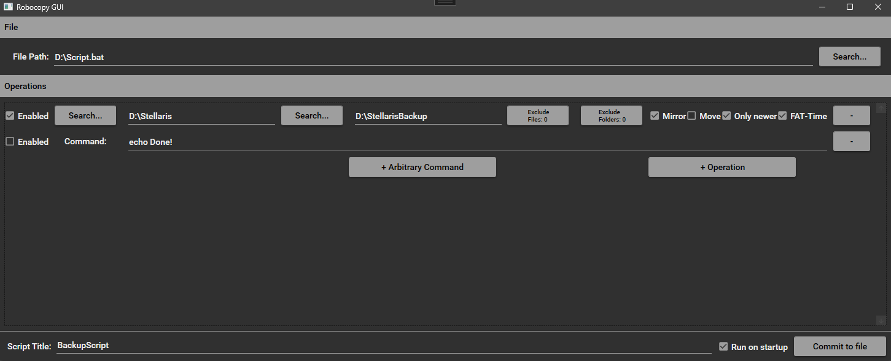
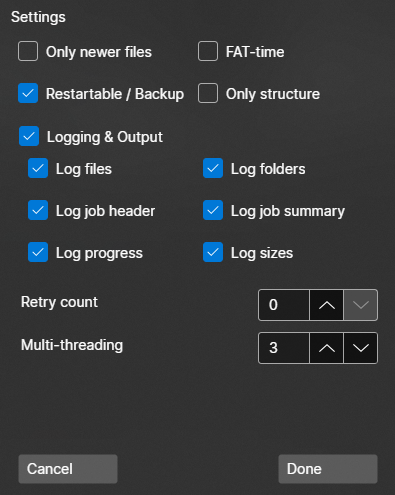

> [!WARNING]
> This project is no longer maintained.
> 
> The program still works at the time of writing and there is no reason to expect that changing soon, but there won't be any more updates because I'm no longer using Windows and therefore not using this program anymore.

  

# robocopy-gui

#### Windows GUI for managing robocopy-based .bat-scripts for backup purposes 

  
  
  

## Features

- manages (technically any) Windows batch file (.bat) in a GUI
- support for Windows-style file and folder exclusions incl. wildcards
  - eg. `OLD-test.dll`, `*.dll`, `OLD*`
- supports settings for most important robocopy options (if you miss something, please open an issue)
- support for arbitrary commands (excl. `echo`)
  - echo is ignored during parsing
- adding and removing files to/from on-logon startup "programs"
- enabling and disabling per-command (`REM`)

## Installation

Grab your executable from the [release page](https://github.com/crowbait/robocopy-gui/releases).
The program is portable (so it doesn't need to be installed) and carries it's dependencies. Settings however are stored on the local machine and are not portable.

Binaries are built for x64 Windows.
Important: the program is targeting Windows 10.0.18362 and *might or might not* work on older versions. Theoretically, it should work down to Windows 7.

## First steps
#### Create your first backup script

- generate your file
  - either create a new file, name it `something.bat` and point the program to it by using the "Search"-button at the top
  - or type any path, even to non-existent files, into the field at the top
- add operations
  - select the folder you want to back up (the source) and the folder which should contain the backed-up files (the destination) by either using the "Search"-buttons or typing the paths
  - exclude files & folders if you'd like
  - if you don't know about settings, the standard should be well suited for backup needs
    - if you'd like to keep files in the destination folder that are *not* present in the source anymore, uncheck "Mirror"
- name your script
- check "Run on Startup" if you'd like your script to run every time you log into Windows
- Commit to File!

## To-do

- dialog for default settings of new operations, save to registry
- option for rotating backups (eg. Monday - Sunday, restart)
  - variable length of rotation?

#### Delayed indefinitely
These items seem either impossible or at least unfeasible. Further research might be required and ideas on tackling these problems have not been successful so far.
- drag-and-drop reordering of operations
- visual grouping of operations

## Development

- development using Visual Studio 2022 is recommended
- installation of [AvaloniaUI extension](https://avaloniaui.net/GettingStarted#installation) is recommended
- Solution is set up to produce self-contained `.exe` in folder `publish`, using Visual Studio's publishing function
